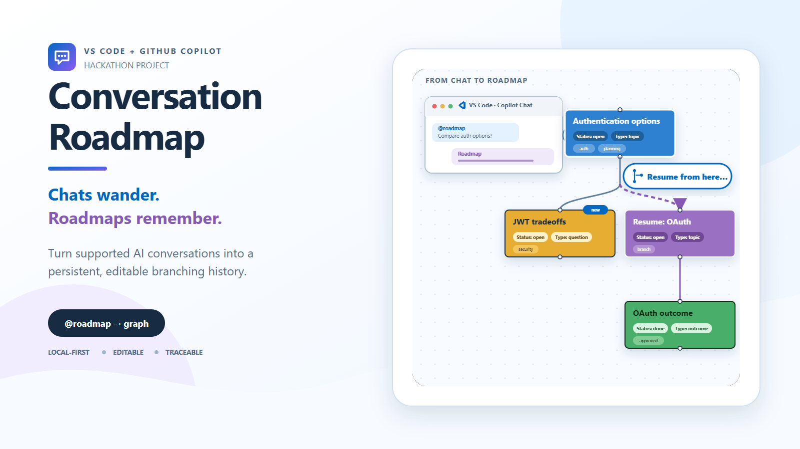

# Conversation Roadmap

> Your chat started with "one quick question." Thirty turns later, the answer
> is somewhere between a side quest, a decision you forgot, and three tabs you
> are afraid to close.

Conversation Roadmap turns supported GitHub Copilot conversations into a
persistent, editable graph inside VS Code. It gives long AI conversations a
memory you can see: topics, questions, branches, decisions, tasks, outcomes,
and the source messages behind them.

**Chats wander. Roadmaps remember.**



## See it in action


[Watch the 89-second narrated demo](docs/media/conversation-roadmap-demo.mp4)
· [Read the demo transcript](docs/media/DEMO_SCRIPT.md)

## Why use it?

### The investigation that keeps growing

You ask how a loop works. Then you ask about stopping conditions, infinite
loops, and agent loops. Conversation Roadmap keeps the shared topic and adds
each distinct follow-up beneath it instead of turning the transcript into a
wall of scrollback.

### The decision with three alternate universes

You compare JWT, sessions, and OAuth. Keep the main path, branch an alternative,
tag the decision, add your own notes, and return later without pretending the
other options never happened.

### The "where were we?" Monday morning

Select any node to see the exact `@roadmap` request and response that produced
it. Use **Resume from here** to preview the relevant context and continue as a
new, traceable branch.

### The hackathon handoff

Export a JSON backup, Mermaid Markdown, or a standalone SVG. Share the shape of
the conversation without taking screenshots of a 200-message chat.

## Install the 0.1.2 beta

### Download

1. Download
   [conversation-roadmap-0.1.2.vsix](https://github.com/nanma321/vscode-conversation-roadmap/releases/download/v0.1.2/conversation-roadmap-0.1.2.vsix).
2. In VS Code, open the Extensions view.
3. Open the `...` menu and select **Install from VSIX...**.
4. Choose the downloaded file and reload VS Code when prompted.

Or install from a terminal:

```powershell
code --install-extension conversation-roadmap-0.1.2.vsix
```

### Requirements

- Visual Studio Code 1.137 or later
- GitHub Copilot access
- A language model authorized through VS Code

## Quick start

1. Open GitHub Copilot Chat in VS Code.
2. Start with a request such as:

   ```text
   @roadmap Help me compare three authentication approaches.
   ```

3. Wait for the response. Conversation Roadmap automatically prepares
   `@roadmap ` in the input for your next question without sending it.
4. Continue typing naturally:

   ```text
   What are the security tradeoffs?
   ```

5. Open the Command Palette and run
   **Conversation Roadmap: Open Graph**.

Your captured conversation now has a visual path, and every generated node
remains linked to its source turn.

> [!IMPORTANT]
> VS Code only exposes messages explicitly routed to `@roadmap`. A misspelled
> mention, ordinary Copilot message, or message sent to another participant is
> invisible to this extension and cannot be recovered retroactively.

## Everyday workflows

### Read the conversation three ways

- **Graph view** shows the spatial roadmap with typed connections.
- **Outline view** provides a keyboard-friendly tree and connection list.
- **Session transcript** shows the captured requests and formatted responses.

### Inspect and organize a node

Select a node to:

- Read its source conversation
- Change its title, type, or status
- Add personal notes and tags
- Mark it as important
- Apply a visual grouping color
- Move it by dragging or keyboard nudge controls
- Merge it into another node
- Split source turns into a separate node

Graph cards show three tags plus a `+N` indicator. All tags remain available in
details, search, filtering, and exports.

### Search without losing the map

Search titles, summaries, notes, tags, and source transcripts. Narrow results
by type, status, tag, highlighted state, or newest nodes. Non-matches are
dimmed so the surrounding graph structure remains visible.

Use the funnel icon to collapse search and filters when you want the canvas
back.

### Resume from a useful moment

1. Select a node.
2. Choose **Resume from here**.
3. Review the exact context that will be sent.
4. Add an optional follow-up question.
5. Create the branch and submit the prepared chat input.

The submitted response fills the single Resume node. Later turns continue as a
chain beneath it:

```text
Original topic
└── Resume
    └── Follow-up
        └── Another follow-up
```

The original path and transcript remain unchanged.

### Correct the graph

- Drag from one node handle to another to create a manual connection.
- Click a line to edit its source, destination, label, or type.
- Use **Undo** and **Redo** for graph transactions.
- Use merge and split when summarization grouped something incorrectly.

### Clean up safely

- The trash icon in the graph toolbar clears all graph nodes and connections
  but keeps captured transcripts. Cleared turns do not silently regenerate.
- **Conversation Roadmap: Delete All Local Data** permanently deletes graphs
  and captured transcripts after confirmation.

## Export and share

| Format | Command | Best for |
|---|---|---|
| JSON | **Conversation Roadmap: Export Roadmap (JSON)** | Complete backup and later import |
| Markdown | **Conversation Roadmap: Export Graph + Outline (Markdown)** | Mermaid-enabled docs plus a readable text outline |
| SVG | **Conversation Roadmap: Export Visual Graph (SVG)** | Slides, design docs, browsers, and scalable images |

JSON imports are validated and never silently overwrite an existing roadmap
with the same ID.

## Commands

Open the Command Palette with `Ctrl+Shift+P` and search for
**Conversation Roadmap**.

| Command | What it does |
|---|---|
| **Open Graph** | Opens the roadmap editor |
| **Continue with @roadmap** | Restores the participant mention if automatic prefill is unavailable |
| **Resume from Selected Node** | Resumes from the selected graph node |
| **Export Roadmap (JSON)** | Creates a complete, re-importable backup |
| **Import Roadmap (JSON)** | Validates and imports a roadmap backup |
| **Export Graph + Outline (Markdown)** | Creates Mermaid Markdown and a readable outline |
| **Export Visual Graph (SVG)** | Creates a standalone accessible vector graph |
| **Delete All Local Data** | Deletes all stored turns and graphs after confirmation |
| **Show Onboarding and Known Limitations** | Reopens the first-run privacy explanation |

## Settings

| Setting | Default | Purpose |
|---|---:|---|
| `conversationRoadmap.autoPrefillMention` | `true` | Prepares `@roadmap ` after each response without submitting it |
| `conversationRoadmap.showOnboarding` | `true` | Shows the participant-only limitation on first use |

## Privacy and data

- Conversation content is stored locally under the extension's VS Code global
  storage directory.
- Only messages routed to `@roadmap` reach the extension.
- Resume shows a preview before context is prepared for chat.
- No conversation telemetry is collected.
- Webview messages, model output, and imports are validated before persistence.
- Turn and graph files use atomic writes and recover from interrupted temporary
  files.

The roadmap graph is cumulative across captured sessions. Use the Session
selector to focus the graph or outline on one conversation without deleting
anything.

## Accessibility

Conversation Roadmap includes:

- Keyboard-operable graph actions and node movement
- A navigable outline and connection list
- Screen-reader names for node type, status, state, and relationships
- Modal focus trapping, Escape dismissal, and focus restoration
- Reduced-motion support
- Theme-aware focus indicators and contrast-safe custom node colors

The release assessment found zero axe-core violations across graph, node
details, connection details, resume, merge, outline, and transcript states.

## Learn more

- [Latest beta release](https://github.com/nanma321/vscode-conversation-roadmap/releases/tag/v0.1.2)
- [Troubleshooting and known limitations](docs/TROUBLESHOOTING.md)
- [Completed implementation plan](docs/IMPLEMENTATION_PLAN.md)
- [Accessibility support](docs/ACCESSIBILITY.md)
- [Accessibility assessment](docs/ACCESSIBILITY_ASSESSMENT.md)
- [Raw axe-core results](docs/accessibility/axe-results.json)
- [Changelog](CHANGELOG.md)
- [GitHub Actions](https://github.com/nanma321/vscode-conversation-roadmap/actions)
- [Report an issue](https://github.com/nanma321/vscode-conversation-roadmap/issues)

## Develop locally

```powershell
npm ci
npm test
```

Press F5 to launch the Extension Development Host. `npm test` compiles the
extension and React Webview before running the complete test suite.

Build an installable VSIX with:

```powershell
npm run package
```

## Project status

Conversation Roadmap is a hackathon beta. The core workflow is working and
packaged, but real-world participant routing, model behavior, and long-running
conversation patterns still benefit from beta feedback.

Contributions, bug reports, and creative conversation rabbit holes are welcome.

## License

[MIT](LICENSE)
