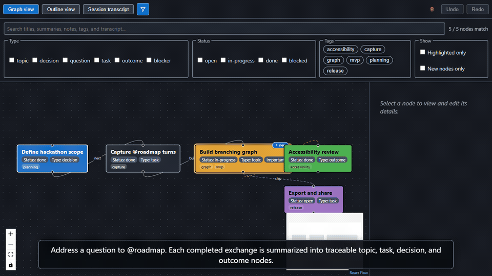

# Conversation Roadmap

A VS Code extension that turns supported `@roadmap` conversations into a
persistent, editable branching graph. It preserves source-message provenance,
supports resuming from earlier topics, and exports roadmaps as JSON, Mermaid
Markdown, or SVG.

> [!IMPORTANT]
> VS Code's public chat API only exposes messages explicitly addressed to
> `@roadmap`. The extension cannot read ordinary Copilot chat history or turns
> sent to other participants.

## Demo



[Watch the 76-second narrated demo](docs/media/conversation-roadmap-demo.mp4)
· [Read the demo transcript](docs/media/DEMO_SCRIPT.md)

## Install the 0.1.2 beta

1. Download [conversation-roadmap-0.1.2.vsix](https://github.com/nanma321/vscode-conversation-roadmap/releases/download/v0.1.2/conversation-roadmap-0.1.2.vsix).
2. In VS Code 1.137 or later, open the Extensions view and choose
   **Install from VSIX...** from the `...` menu.
3. Select the downloaded file and reload VS Code when prompted.

You can also install from a terminal:

```powershell
code --install-extension conversation-roadmap-0.1.2.vsix
```

## Features

- A `@roadmap` chat participant can be registered and only receives
  requests explicitly addressed to it (`contributes.chatParticipants` +
  `vscode.chat.createChatParticipant`).
- Each request/response turn is logged to local disk
  (`src/turnStore.ts`), using only `context.globalStorageUri` and Node's
  `fs` module - no undocumented VS Code APIs.
- Captured turns are folded into the roadmap graph by incremental
  summarization: after each turn is recorded,
  `src/summarization/summarizationService.ts` builds the summary prompt,
  asks a user-authorized language model, and applies the validated response
  to the default roadmap (`summarizeIncrementally`), which then appears as
  graph nodes. The model call is injected, so the summarization logic itself
  stays free of `vscode` and unit-testable; a turn is attempted at most once,
  runs are serialized, invalid model output leaves the graph unchanged, and
  the per-roadmap `autoSummarize` setting can disable it.
- A graph Webview (`src/webviewPanel.ts` + `src/webview/`, a React + React
  Flow app bundled with `esbuild.js` into `media/graph.js`) renders the
  persisted roadmap graph: pan/zoom/minimap/fit-to-view, node selection with
  a transcript detail panel, dragging to reposition nodes, and editing a
  node's title, type, status, personal notes, tags, grouping color, and
  highlight state. Status and type badges are explicitly labeled on each
  graph node so they are not confused with user tags. A manually changed
  status is protected from later automatic-summary updates. An accessible
  outline/tree view is available as a keyboard-only alternative to the
  canvas. The roadmap graph is **cumulative** (every chat's summarized
  turns accumulate into one persistent graph); a **Session** filter in the
  toolbar can narrow the graph/outline to a single chat (labeled from that
  session's first `@roadmap` request plus its date) as a view-only transform
  that never changes the persisted roadmap. A third "Session transcript" view lets you
  browse the raw captured turns grouped by chat **session** via session
  chips at the top - a new chat starts a fresh session, older sessions stay
  selectable, the view follows the newest session by default until you click
  into an older one, and turns persisted before sessions existed are grouped
  as "Earlier turns". Every edit is sent as a Webview message that the
  extension host validates (`src/webviewMessages.ts`) before persisting it via
  `RoadmapStore`, so edits survive a reload and a malformed message can
  never corrupt the graph. The Webview's Content-Security-Policy disallows
  everything by default and only allows scripts tied to a per-load nonce;
  `style-src` additionally allows `'unsafe-inline'` so React can apply
  inline styles (color swatches, outline indentation).
- Storage survives a reload: the "Conversation Roadmap: Open Graph" command re-reads
  `turns.json` from disk every time it runs, so turns captured in a prior
  session are still shown after a restart.
- The Roadmap Graph opts out of editor restoration. If VS Code tries to revive
  a graph from its saved window layout, the extension's webview serializer
  closes that tab instead. This does not delete captured turns or graph data;
  run "Conversation Roadmap: Open Graph" to reopen it.

## Resume from a Node (Phase 7)

Selecting a node and choosing **Resume from here** (in the node details
panel, or the **Conversation Roadmap: Resume from Selected Node** command)
starts a *new* branch of conversation seeded with the context that led up to
that node:

- **Context construction** (`src/resume/resumeContext.ts`, `vscode`-free so
  it is shared by the Webview preview, the extension host, and unit tests)
  walks the selected node's ancestor path through the graph and assembles the
  source request/response turns in order. It de-duplicates any turn shared by
  multiple nodes, is cycle-safe, and caps the number of turns and total
  characters (dropping the oldest first, flagging truncation) to **prevent
  duplicate or oversized context**.
- **Preview before sending**: a modal shows the exact context that will be
  sent and clearly states that resuming creates a new branch and does **not**
  modify the original transcript, with an optional follow-up question - per
  the product design's requirement to explain the context before a resume.
- **Traceable branch**: confirming creates a new child node linked to the
  source node by a `"branch"` edge (labelled `resume`). The source node and
  its path are left untouched, so the original transcript and graph path are
  preserved. The branch is undoable like any other graph transaction.
- **Starting the interaction / public-API constraint**: VS Code exposes **no
  public, typed API to programmatically invoke a chat participant or inject a
  user turn**, and the product design forbids depending on private/internal
  commands. The host therefore seeds a new `@roadmap` interaction by
  *prefilling* the chat input via the built-in `workbench.action.chat.open`
  command (the user still presses Enter, so nothing is sent without consent),
  probing for the command first and falling back to copying the context to
  the clipboard if it is unavailable. Because the branch node/edge is created
  and persisted regardless, the branch stays traceable even if the chat is
  never opened. A consequence of this constraint: automatically linking the
  *future* resumed turn's captured record back into the branch node's
  `sourceRefs` is not possible through public APIs until the user sends the
  message and a later summarization pass runs.

## Release preparation (Phase 10)

- **Onboarding**: the first time the extension activates, an information
  message explains the Phase 1 limitation that only messages explicitly
  addressed to `@roadmap` can ever be captured (VS Code's `vscode.chat` API
  exposes a participant's handler only to requests sent to it, never to
  other participants' or unscoped chat history). Reopen it any time with
  **Conversation Roadmap: Show Onboarding and Known Limitations**, or disable it via the
  `conversationRoadmap.showOnboarding` setting. See
  `docs/TROUBLESHOOTING.md` for this and other known limitations.
- **Marketplace metadata**: `package.json` declares a publisher, license,
  repository, keywords, gallery banner, and extension icon
  (`media/icon.png`); every contributed command has a category and icon.
- **Packaging**: `npm run package` builds a `.vsix` with `@vscode/vsce`
  (via `npx`, so it is not an added project dependency). Install it into a
  clean profile with `code --profile "Roadmap Clean Test"` followed by
  **Install from VSIX...** (or `code --install-extension <file>.vsix`) to
  confirm it activates without relying on any other locally installed
  extension or workspace state; see `docs/TROUBLESHOOTING.md` for the full
  steps.
- **Documentation**: user-facing troubleshooting and known limitations live
  in `docs/TROUBLESHOOTING.md`; `CHANGELOG.md` tracks release-notable
  changes.

## Running

Requires VS Code 1.137 or later.

```
npm install
npm run compile
```

Then press F5 in VS Code to launch an Extension Development Host, open
the Chat view, and address a message to `@roadmap`. Run the
**Conversation Roadmap: Open Graph** command to view the captured turns as a graph.

## Project documentation

- [Completed implementation plan](docs/IMPLEMENTATION_PLAN.md)
- [Accessibility support](docs/ACCESSIBILITY.md)
- [Accessibility assessment results](docs/ACCESSIBILITY_ASSESSMENT.md)
- [Troubleshooting and known limitations](docs/TROUBLESHOOTING.md)

## Exporting

- **Conversation Roadmap: Export Roadmap (JSON)** writes the complete versioned data model
  for backup or later import.
- **Conversation Roadmap: Export Graph + Outline (Markdown)** writes a Mermaid flowchart
  followed by a readable nested outline containing status, type, tags,
  summaries, and notes.
- **Conversation Roadmap: Export Visual Graph (SVG)** writes a standalone vector image using
  saved node positions, colors, types, statuses, labels, and connections. The
  SVG includes a title and description for assistive technologies.

## Tests

```
npm test
```

Unit tests cover `TurnStore` (`test/turnStore.test.ts`), the domain model
(`test/model/`), incremental summarization (`test/summarization/`), the
graph Webview's message validation (`test/webviewMessages.test.ts`) - every
message shape the Webview can send to the extension host, including
malformed/unrecognized ones, and that edits apply only to the targeted node
- its auto-layout fallback (`test/webview/layout.test.ts`), and resume-branch
construction (`test/resume/`): ancestor-path context building with
de-duplication and size caps, and branch node/edge creation that leaves the
original path unchanged. `test/reliability/` (Phase 9) covers the Webview's
Content-Security-Policy string and incremental summarization at scale (500
turns applied in small batches, verifying compaction and provenance are
preserved). `test/onboarding.test.ts` (Phase 10) covers the onboarding
notice's wording and show/hide decision, and
`test/reliability/marketplaceMetadata.test.ts` (Phase 10) covers
`package.json`'s Marketplace metadata, command categories/icons, and
settings.

## Security, privacy, and reliability (Phase 9)

- **Content-Security-Policy**: the graph Webview's CSP is built by the pure,
  unit-tested `buildContentSecurityPolicy` (`src/webviewCsp.ts`) - deny by
  default (`default-src 'none'`), scripts restricted to a fresh per-load
  nonce (no `'unsafe-inline'`/`'unsafe-eval'`), and every resource directive
  scoped to the Webview's own origin, never an arbitrary remote one.
- **Untrusted Webview messages**: every message the Webview sends to the
  host is validated by `validateWebviewMessage`/`applyWebviewMessage`
  (`src/webviewMessages.ts`) before it can touch persisted state; malformed
  or unrecognized messages are rejected without changing the roadmap. Messages
  the host sends *to* the Webview are not user input and carry only roadmap
  data the extension itself produced.
- **Local data deletion**: the **Conversation Roadmap: Delete All Local Data** command
  (`src/dataDeletion.ts`) permanently erases every captured turn and
  roadmap graph after an explicit, modal confirmation, and refreshes any
  open graph panel to reflect the now-empty state.
- **Direct connection editing**: click a line in Graph view to select it,
  then change its source, destination, optional label, or line type in the
  details panel. Saving participates in Undo/Redo; deletion is a separate
  confirmed action.
- **Clear node organization controls**: **My notes** holds user-authored
  context that automatic summaries never overwrite; **Highlight as
  important** adds filterable emphasis; and **Color (visual group)** groups
  related nodes visually. Tag filtering uses selectable chips derived from
  tags already present in the selected session rather than requiring exact
  comma-separated input. Branches remain visible through their orange,
  animated connections instead of a separate technical branch-only filter.
- **Compact controls**: the funnel icon in the graph toolbar collapses the
  search area while keeping the current query and filters active. Its
  accessible label reports the current match count while collapsed.
- **Graph-only cleanup**: **Clear all graphs** permanently removes every
  roadmap node and connection after a trusted VS Code confirmation, while
  retaining the captured session transcripts. Cleared transcripts are marked
  as intentionally excluded so they do not recreate old graphs after restart;
  future `@roadmap` turns continue generating new nodes normally.
- **Newest-node emphasis**: the latest created node or summarization batch is
  marked with a small **new** sticker (and a New badge in Outline view). The
  marker survives reloads and moves only when a newer node or creation batch
  is added. **New nodes only** can emphasize just that latest batch.
- **Contrast-safe nodes**: default nodes use VS Code's editor-widget
  background and foreground tokens instead of unrelated button colors.
  Custom node colors automatically select whichever of black or white has
  the stronger contrast. Automated MAS 1.4.3 checks enforce at least 4.5:1
  across the built-in swatches and a representative 4,096-color RGB grid;
  highlighted nodes also display an **Important** badge instead of relying
  on color alone.
- **Safe merge preview**: merging first shows both nodes, lets the user choose
  which title survives, and explains what will be retained. Both summaries,
  notes, tags, source-turn provenance, and redirected connections are kept;
  the completed merge remains undoable.
- **No telemetry**: this extension does not send any telemetry and has no
  dependency on `vscode.env.createTelemetryLogger` or similar APIs.
  Conversation content (turns, summaries, roadmap graphs) is stored only
  locally under `context.globalStorageUri` and is never transmitted
  anywhere by the extension.
- **Recovery from interrupted writes**: both `TurnStore` and `RoadmapStore`
  write via a temp file + atomic rename, so `turns.json`/`roadmaps.json`
  can never be left partially written. On every `load()`, each store also
  cleans up any orphaned `*.tmp-*` file left behind by a write that was
  interrupted (e.g. a crash) between that temp-file write and the rename,
  without ever touching the real, already-persisted file.
- **Supported VS Code versions**: `package.json#engines.vscode` declares the
  minimum supported VS Code version, and `@types/vscode` is pinned to that
  *exact* same version (not a caret range) so `tsc` can only accept calls to
  APIs that already exist on the declared minimum - an API only available in
  a newer VS Code release simply fails to compile. `npm run compile`
  succeeding is therefore itself the check that the extension's code is
  compatible with every VS Code version it claims to support, and
  `test/reliability/vscodeVersionCompatibility.test.ts` guards against the
  `@types/vscode` pin drifting away from `engines.vscode` again.
